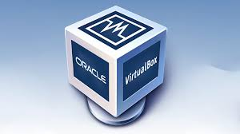

# Deliverable 1 

## Basic Terminology

### What is a web server?
A web server is a system that delivers content, such as web pages, images, and videos, to users through the internet. It works by receiving requests from users (usually through web browsers) and then sending back the appropriate content. This process happens using the HTTP protocol (Hypertext Transfer Protocol), which is the language that browsers and web servers use to communicate. From a hardware perspective, a web server is a physical machine that stores data and runs server software. This machine could be a specialized server in a data center or even a regular computer. The hardware typically includes a processor (CPU), memory (RAM), storage devices (such as hard drives or SSDs), and a network connection to send and receive data over the internet. On the software side, a web server is the program running on the machine that handles requests and responses. Examples of web server software include Apache, Nginx, and Microsoft IIS. This software manages the server's resources, processes the incoming requests from users, and serves the correct files, such as HTML pages or images. It can also handle additional tasks like logging activity, managing security, and ensuring the server runs smoothly. 

### What is Apache?
Apache is a widely-used web server software that serves web pages to users over the internet. It is open-source and runs on many operating systems, including Linux, Windows, and macOS. Apache handles HTTP requests from users' browsers and sends back the appropriate content, such as HTML pages or images. It is highly customizable through configuration files and supports various modules to extend its functionality, like handling PHP or SSL encryption. Apache is one of the most popular web servers and is often used to host websites and applications. 

### What are some different web server applications?

| Application Name | license                          | Project's Website               |
| ---------------- | -------------------------------- | ------------------------------- |
| Nginx      | 2-clause BSD License          | [Nginx](https://www.f5.com/go/product/welcome-to-nginx) |
| Apache       | Apache License 2.0               | [Apache](https://httpd.apache.org/) |
| Caddy        | Apache License 2.0                     | [Caddy](https://caddyserver.com/) |

#### Nginx
 
Nginx is a high-performance, open-source web server software that is often used to serve static content, act as a reverse proxy, and load balancer for web applications. Known for its speed, efficiency, and ability to handle a large number of simultaneous connections, Nginx is widely used in high-traffic websites and cloud environments. It is particularly good at handling static files (like images or HTML) and managing heavy loads with minimal resource consumption, making it a popular choice for businesses that need to scale quickly. Nginx uses an event-driven architecture, which allows it to process multiple requests with fewer resources compared to traditional web servers. Nginx is available under a 2-clause BSD-like license, which allows you to freely use, modify, and distribute the software. The open-source version is free, but there is also a commercial version, Nginx Plus, which offers additional features and enterprise support. 

#### Apache
 
Apache HTTP Server is one of the most popular and oldest open-source web server software. First released in 1995, Apache has been a core part of the web infrastructure for decades, known for its stability, flexibility, and rich feature set. Apache supports a wide range of features such as SSL/TLS encryption, customizable configuration through .htaccess files, URL rewriting, authentication, and access control. It also supports various programming languages like PHP, Python, and Perl through modules, which makes it highly versatile for hosting dynamic websites and web applications. Apache can be configured to serve static files or handle complex dynamic content and is used by many large websites and organizations. Apache is licensed under the Apache License 2.0, a permissive open-source license that allows users to freely use, modify, and distribute the software, while also providing warranties and clarifying trademark usage. The Apache Software Foundation manages the development of Apache, ensuring long-term support and a large community of contributors. 

#### Caddy
 
Caddy is an open-source web server that is designed to be easy to configure and highly secure out of the box. One of Caddy’s standout features is its automatic TLS (SSL) encryption, meaning it automatically sets up HTTPS for your websites without the need for manual configuration or SSL certificates. Caddy is often used for personal websites, development environments, or small businesses because of its simplicity, ease of use, and automatic HTTPS support. Its configuration is typically done through a simple text file, and it has built-in support for things like reverse proxying, HTTP/2, and load balancing. Caddy is licensed under the Apache 2.0 License, which allows anyone to freely use, modify, and distribute it while requiring attribution and including the same license in redistributed versions. There is also a commercial version, Caddy Enterprise, which offers additional features like enterprise support and advanced security. 

### What is virtualization?
Virtualization is a technology that allows you to create multiple "virtual" versions of something, such as a computer, operating system, or storage device, all on a single physical machine. It works by using special software called a hypervisor, which divides the physical resources (like CPU, memory, and storage) of a computer into separate, isolated environments called virtual machines (VMs). Each VM operates like a separate computer, with its own operating system and applications, even though they are running on the same physical hardware. The key benefit of virtualization is that it allows you to run multiple systems or services on one physical machine, making better use of hardware resources. For example, a single server can run several virtual servers, each hosting different applications or websites. This increases efficiency and can reduce the need for additional physical hardware. Virtualization is also useful for testing new software or configurations without affecting the main system, as each virtual machine is isolated from the others. It is widely used in data centers and cloud computing to provide scalability and flexibility.

### What is a virtual machine?
A virtual machine (VM) is a software-based emulation of a physical computer. It runs an operating system and applications just like a real computer, but it exists inside another physical computer. VMs are created using virtualization software (like VMware or VirtualBox), which allows you to run multiple operating systems on the same hardware. For example, you can run Windows on a computer that has Linux installed. Each VM is isolated, so problems in one don't affect the others. Virtual machines are useful for testing new software, running different operating systems, or running multiple applications without needing extra physical computers. 

### What is virtualbox?
 
VirtualBox is a free, open-source software that allows you to run multiple virtual machines (VMs) on your computer. It works by creating a "virtual" computer inside your physical computer, enabling you to run different operating systems at the same time. For example, you can run Windows on a computer that has Linux installed, or vice versa. VirtualBox is useful for testing software, trying new operating systems, or running programs that only work on certain platforms, without needing to have separate physical machines. It's simple to use and is compatible with many operating systems like Linux, Windows, macOS, and others. It also supports features like snapshots, which let you save the state of a VM and restore it later. 

### What is Ubuntu Server?
 
Ubuntu Server is a version of the Ubuntu Linux operating system specifically designed for use on servers. It is free and open-source, meaning anyone can download and use it. Unlike desktop versions of Ubuntu, the server version doesn’t come with a graphical user interface (GUI), making it more efficient for handling server tasks. Ubuntu Server is popular because it’s easy to install, configure, and maintain. It is commonly used to host websites, databases, or cloud applications. It also has strong community support and regular security updates. 

### What is a firewall?
A firewall is a security system that controls incoming and outgoing network traffic based on predetermined security rules. It acts as a barrier between your computer or network and the internet, blocking harmful traffic while allowing legitimate data to pass through. Firewalls can be hardware devices or software running on a computer. They are essential for protecting systems from cyber attacks, malware, and unauthorized access. Firewalls work by inspecting packets of data to determine whether they should be allowed or blocked, based on their source, destination, or content.

### What is SSH?
SSH (Secure Shell) is a protocol used to securely connect to another computer over a network. It allows you to log in to remote servers, run commands, and transfer files in a secure, encrypted way. SSH is commonly used by system administrators to manage servers because it protects data from being intercepted. Unlike other protocols like Telnet, which send data in plain text, SSH encrypts all communication, ensuring that no one can eavesdrop on your activity. SSH is often used for remote access to Linux-based servers. 

## Other Relevant Concepts I don't understand:
* **Systemd**: 
Systemd is a system and service manager used in many Linux-based operating systems. It is responsible for starting, stopping, and managing system services like network connections, web servers, and databases. Systemd also handles tasks like system boot-up, logging, and device management. It replaces older init systems and offers a more modern and efficient way to manage processes. Systemd is designed to improve system performance, reliability, and flexibility, allowing administrators to manage services more easily.

* **Systemctl**: 
Systemctl is a command-line tool used to interact with Systemd, the system and service manager on many Linux-based systems. It allows administrators to start, stop, restart, and check the status of system services, like web servers, databases, or networking services. For example, you can use systemctl to restart Apache or check if a service is running. Systemctl also allows you to manage system states like shutting down, rebooting, or entering a specific runlevel (like multi-user mode).

* **Init system**:
An init system is the first process that runs when a computer boots up. It is responsible for initializing the system and starting all other necessary processes, services, and applications. Historically, the init system used in Unix-like systems was the SysVinit, but more modern systems use Systemd or other alternatives. The init system manages how services are started and stopped, ensuring that everything is running correctly. It also handles system shutdowns, reboots, and user logins. 

* **Virtual hosts**: 
Virtual hosts allow a single physical web server to host multiple websites. Each virtual host is a separate configuration that tells the server how to respond to different domain names or IP addresses. For example, a server can host both "www.example1.com" and "www.example2.com" by using different virtual hosts. Virtual hosting is commonly used in shared hosting environments, where multiple websites share the same server but have different content and domain names.

* **Software repository**:
A software repository is a storage location where software packages are kept and made available for download and installation. Repositories are commonly used by Linux distributions, like Ubuntu, to manage software updates and installations. When you want to install a program, the package manager of the operating system will download it from a repository. These repositories can be online or local and typically contain verified, tested software to ensure security and stability. In Linux, repositories allow users to install and update software quickly and easily using commands or a graphical interface.

* **Log file**
Log files are records of events and activities that happen on a computer or server. They are created by software applications, operating systems, or services to track what is happening and help troubleshoot problems. For example, a web server like Apache or Nginx creates log files to record incoming requests from users, errors, or other activities. These files are usually plain text and can be reviewed by system administrators or developers to understand how a system is performing or to diagnose issues. Log files can also contain important security information, like failed login attempts or unauthorized access, which can be useful for identifying potential threats. Common log files include system logs, error logs, and access logs. 

* **Web ports**:
Web ports are communication channels used by web servers and browsers to exchange data. A port is like a door through which information enters or leaves a computer. When you visit a website, your browser connects to a web server via a specific port. The most common web ports are port 80 for regular HTTP traffic and port 443 for HTTPS (secure) traffic. These ports help direct traffic to the correct application or service running on a server. Using specific ports ensures that data is sent to the correct destination. 

* **UFW firewall**:
UFW (Uncomplicated Firewall) is a simple, user-friendly way to manage a firewall on a Linux-based system. It is designed to make configuring firewall rules easier for beginners and system administrators. UFW allows you to block or allow network traffic based on IP addresses, ports, and protocols. It simplifies the process of protecting your server by providing easy-to-use commands. For example, you can use UFW to allow access to web services (port 80 and 443) while blocking everything else. UFW is a popular choice for securing servers running on Ubuntu and other Linux distributions. 

* **TLS/SSL**:
TLS (Transport Layer Security) and SSL (Secure Sockets Layer) are cryptographic protocols used to secure communication over the internet. TLS is the more modern and secure version of SSL, but the term SSL is still often used to refer to both. These protocols encrypt the data exchanged between a web server and a browser, ensuring that sensitive information like passwords or credit card details cannot be intercepted by attackers. When you visit a website with HTTPS, it indicates that TLS or SSL encryption is being used to protect the data transmitted between your browser and the server. 

* **HTTP**:
HTTP (Hypertext Transfer Protocol) is the protocol used to transfer data over the web. It allows web browsers to request and display web pages, images, videos, and other resources from a web server. When you enter a website's address in your browser, an HTTP request is sent to the server, which then responds with the appropriate content. HTTP is a stateless protocol, meaning each request is independent, and the server does not keep track of previous interactions. While HTTP is used for regular web traffic, its secure version is called HTTPS, which encrypts data during transmission. 

* **Web browser**:
A web browser is a software application that allows you to access, view, and interact with content on the internet. Common web browsers include Google Chrome, Mozilla Firefox, and Safari. Browsers interpret and display web pages by loading HTML, CSS, and JavaScript code from web servers. They also allow you to search the internet, manage bookmarks, and use web-based applications. Without a web browser, it would be impossible to browse the internet or view websites. 

* **Browser address bar**:
he address bar in a web browser is the text field at the top of the browser window where you type the web address (URL) of a website. It shows the current URL of the page you are visiting, and you can use it to navigate to different websites. When you type "https://www.example.com" into the address bar, the browser sends a request to that website and displays the content in the main browser window. The address bar is also where you can see if a website is using HTTPS (indicating a secure connection). 

* **Server boot**:
Server boot refers to the process of starting up a server after it is powered on. During the boot process, the server runs a series of tasks, like checking hardware, loading the operating system, and starting essential services (like web servers or databases). The boot process is managed by the system's init system (like Systemd). Once booted, the server is ready to accept requests, perform tasks, and run applications.

* **Server blocks**:
Server blocks are similar to virtual hosts and are used in web servers like Nginx. A server block is a configuration section that defines how the server should handle requests for a particular domain or IP address. It specifies the domain, document root (where the website files are located), and other settings like SSL encryption. Server blocks allow a single web server to manage multiple websites by handling different domains with separate configurations.

* **Domain**:
A domain is the human-readable address used to access websites on the internet. For example, "www.example.com" is a domain name. It serves as a shortcut to the website’s IP address, which is a numerical address used by computers to identify each other in the internet. Domain names are registered through domain registrars and are linked to web servers that store website content. They make it easier for users to access websites instead of having to remember a complex string of numbers.

* **Web Root**:
The web root is the main directory on a server where website files are stored. This is where the web server looks for files to serve when someone visits a website. For example, the web root might contain HTML files, images, and scripts. When you visit a website, the server looks in the web root to find the correct content. The web root directory can vary depending on the server configuration but is located in directories like /var/www/html for Apache or /usr/share/nginx/html for Nginx.

* **Configuration files**:
Configuration files are files used by software applications or systems to define how they should behave. They contain settings that control the operation of services like web servers, databases, or networking. For example, a web server like Apache or Nginx uses configuration files to determine how to handle requests, where to find website files, and whether to use SSL encryption. These files are usually plain text and can be edited by administrators to customize the software's behavior.

* **Configuration errors**:
Configuration errors occur when a system or application is not set up correctly, causing it to behave unexpectedly or fail to work. These errors often happen when there is a mistake in the configuration files that control how software operates. For example, a typo in a web server’s configuration file might prevent the server from starting, or an incorrect setting could make a website inaccessible. Configuration errors can be fixed by reviewing the settings, understanding what went wrong, and making the necessary adjustments.

* **Per-site virtual hosts**:
Per-site virtual hosts are virtual hosts set up for individual websites on a server. Each website has its own virtual host configuration, with details like the domain name, document root, and any specific settings for that site. By using per-site virtual hosts, you can manage different websites separately on the same server, allowing each site to have its own configuration without affecting others.