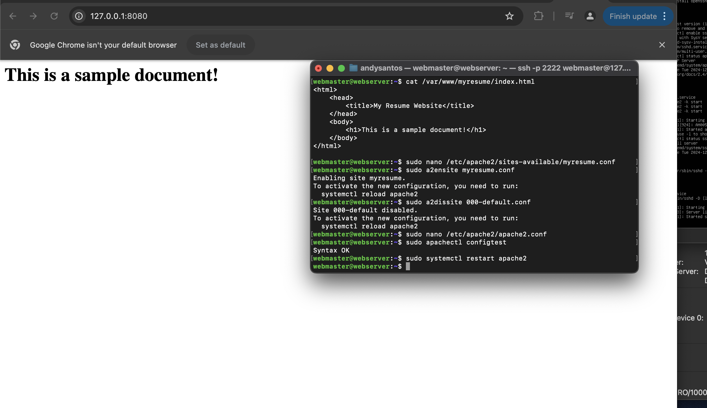
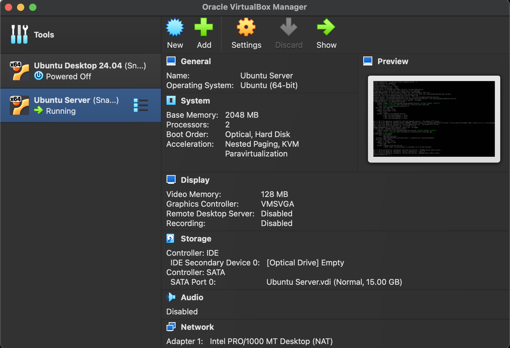
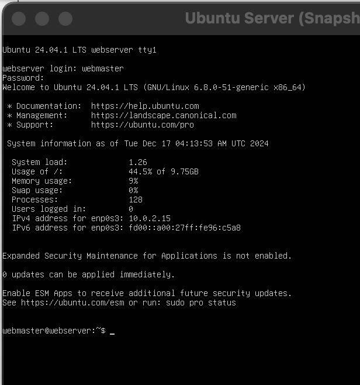
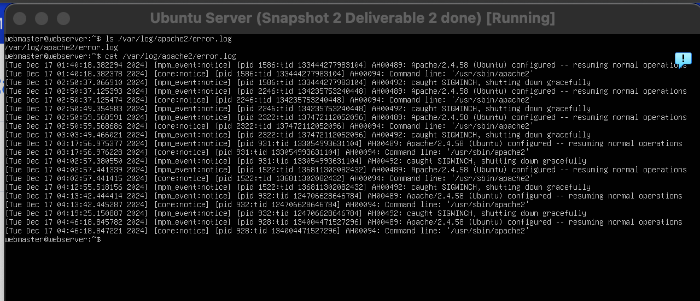

# Deliverable 2 

## Web Samaple Document

## Server Specifications

## Ubuntu Login Screen

## Questions
3. **What is the IP address of your Ubuntu Server Virtual Machine?**
    The IP address for my VM is 10.0.2.15 .

4. **How do you enable the Ubuntu Firewall?**
    The command used is `sudo ufw enable`.

5. **How do you check if the Ubuntu Firewall is running?**
    The command used is `sudo ufw status`.

6. **How do you disable the Ubuntu Firewall?**
    The command used is `sudo ufw disable`.

7. **How do you add Apache to the Firewall?** 
    The command used is `sudo ufw allow 'Apache'`.

8. **What is the command you used to install Apache?**
    The command used is `sudo apt install apache2`.

9.  **What is the command you use to check if Apache is running?**
    The command used is `sudo systemctl status apache2 --no-pager`.

10. **What is the command you use to stop Apache?**
    The command used is `sudo systemctl stop apache2 --no-pager`.

11. **What is the command you use to restart Apache?**
    The command used is `sudo systemctl restart apache2 --no-pager`.

12. **What is the command used to test Apache configuration?**
    The command used is `sudo apachectl -t` or `sudo apachectl configtest`.

13. **What is the command used to check the installed version of Apache?**
    The command used is `sudo apache2 -v`.

14. **What are the most common commands to troubleshoot Apache errors? Provide a brief description of each command.**
    *  **systemctl:** This command interacts with services managed by *systemd*. In Apache, You can use `systemctl` to start, stop, restart, or check the status of the apache service.

    * **journalctl:** This command allows you to view logs generated by *systemd* services, including Apache. It's useful for reviewing detailed logs about what's happening with Apache and identifying any issues. 
    
    * **apachectl:** This command is used to manage Apache and check it configuration. When troubleshooting, you can use `apachectl configtest` to test Apache's configuration for errors before restarting the service.

15. **Which are Apache Log Files, and what are they used for? Provide examples and screenshots.**

## Error log files
 

Apache log files are files generated by Apache HTTP server that record many events and requests made to the server. They are used for monitoring, troubleshooting, and analyzing server activity. There are two types Access logs which records details about incoming requests to the server and error logs which records any errors or issues encountered by the server.
