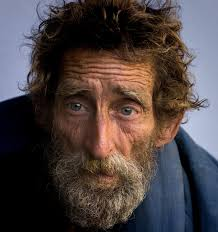

 
# Erik S.

**Student of Passaic County Community College**

I am a Network Administrator, with a strong focus on building a solid foundation in networking protocols, system management, and security practices. My goal is to continue my education at the New Jersey Institute of Technology, where I plan to specialize in Cybersecurity. With a commitment to continuos learning, I aim to contribute to the cybersecurity field by helping organizations mitigate risks and enhance their security posture. Ultimately, I aspire to grow into a leadership role with the field, levering both technical expertise and strategic thinking to address the challenges of the digital landscape.

## Experience
### Old Navy
***Sales floor associate • July, 2021 — Sept, 2022***
As a sales floor associate in a clothing retailer, my primary responsibilities include assisting customers by answering their questions, helping them find the right sizes or styles, and offering product recommendations. I ensure the store is clean and organized by folding clothes, restocking items, and keeping displays tidy. I also operate the cash register, process transactions, and handle returns or exchanges. Additionally, I maintain product knowledge to inform customers about current promotions, sales, and new arrivals. My goal is to provide excellent customer service and ensure a positive shopping experience. 

### Boys & Girls Club of Paterson
***Life Guard • Jun, 2018 — March, 2020***
As a lifeguard, my main responsibility is to ensure the safety of all swimmers by monitoring the pool or beach area for any potential hazards or emergencies. I stay alert and ready to respond quickly to any accidents, providing first aid or CPR when necessary. I also enforce safety rules, such as ensuring that swimmers follow proper conduct and that children are supervised. Additionally, I assist with keeping the swimming area clean and maintaining equipment, such as lifeboats or rescue devices. My priority is to prevent accidents and respond effectively to emergencies, ensuring everyone has a safe experience. 

## Education
### Passaic County Community College
***Associates of Computer Information Technology • 2022 — 2025***

### John F. Kennedy High School
***High School Diploma • 2017 - 2021***

## Skills
***Teamwork and Collaboration***
* I work well with others to achieve common goals, and promoting a position environment where everyone contributes. I also emphasize cooperation, flexibility, and am able to work in cross-functional teams.

***Communications strategy***
* Feedback, Adaptation, and Objective strategy,

***Network Management***
* Network configuration & management, Server management, Firewall configuration & security. 

## Associations
## Paterson Police Athletic League
***Honor Guard • 2014 — 2018***
There was a time I was enrolled in a Police Athletic League In the Police Athletic League, I’ve been taught valuable life skills such as discipline, teamwork, and leadership through sports and activities. The program has also emphasized respect for others, good sportsmanship, and conflict resolution. Through interactions with police officers and community members, I’ve gained an understanding of community service and the role law enforcement plays in keeping neighborhoods safe. Overall, the PAL has helped me build character, confidence, and a strong sense of responsibility.

## Boys & Girls Club of Paterson
***SwimTeam Member • 2013 — 2019***
I would train on weekdays to improve my swimming techniques and endurance in various strokes, such as freestyle, backstroke, breaststroke, and butterfly. I attend team practices, where we focus on drills, speed work, and conditioning to build strength and agility in the water. During meets, I compete in individual races or relay events, striving to achieve personal best times and contribute to the team's success. I also collaborate with my teammates for motivation and support, and we work together to achieve our collective goals. Additionally, I maintain a healthy lifestyle with proper nutrition and rest to stay at my best for training and competitions.
